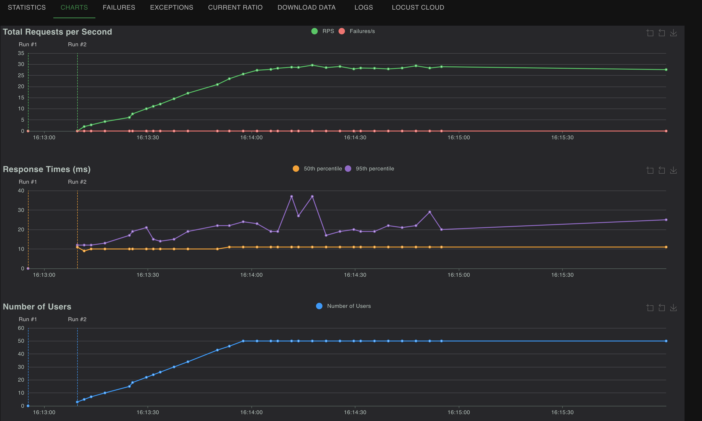
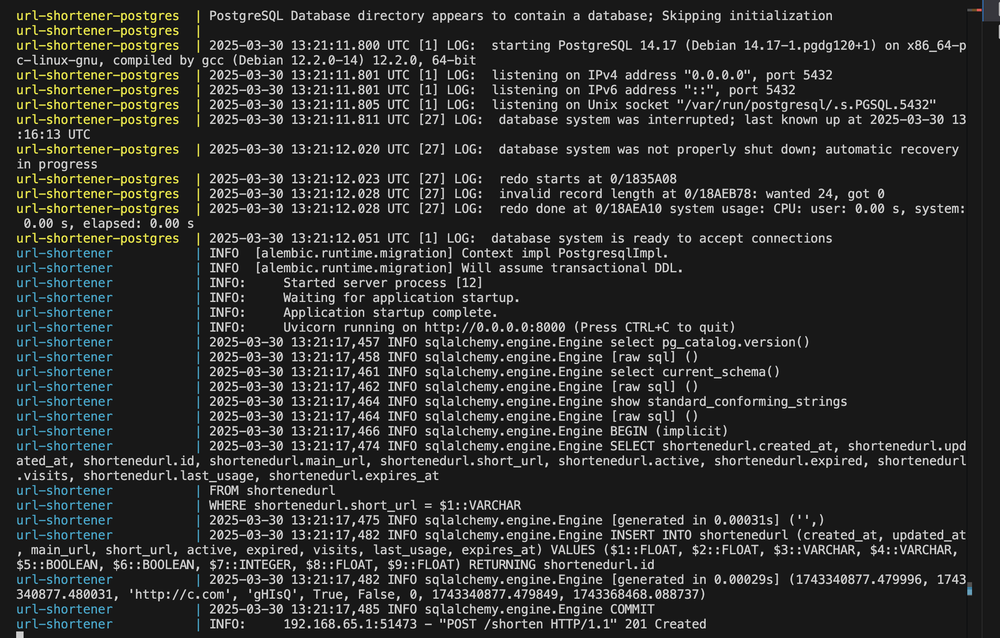

# Сокращатель ссылок FastAPI 


### Запуск
1. 
   ```bash
   git clone https://github.com/yasamprom/url-shortener.git
   cd url-shortener

2. Ставим значения енвов
    ```bash
   cp src/.env.sample src/.env
3. Запуск
    ```bash
    docker-compose up --build


### Что есть в сервисе?
1. Ссылки зранятся в Postgres, который разворачивается в докере.
    Схемы БД можно найти в папке migrations (для миграций использвал alembic)

2. Ссылки кэшируются в Redis, см docker-compose.yaml

### API

`POST /links/shorten` – создает короткую ссылку. Передается также параметр 'alias', который нужно оставить пустым или же вписать кастомную ссылку. Еще передается 'expires_at' - дата потери актуальности ссылки.

`GET /links/{short_code}` – перенаправляет на оригинальный URL.

`DELETE /links/{short_code}` – удаляет связь.

`PUT /links/{short_code}` – обновляет URL (То есть, короткий адрес. Будем засчитывать и другую реализацию - когда к короткой ссылке привязывается новая длинная).

`GET /links/{short_code}/stats` - статистика по ссылке

### Тестирование
Было проведено нагрузочное тестирование с помощью Locust.



### Как выглядит запуск сервиса

